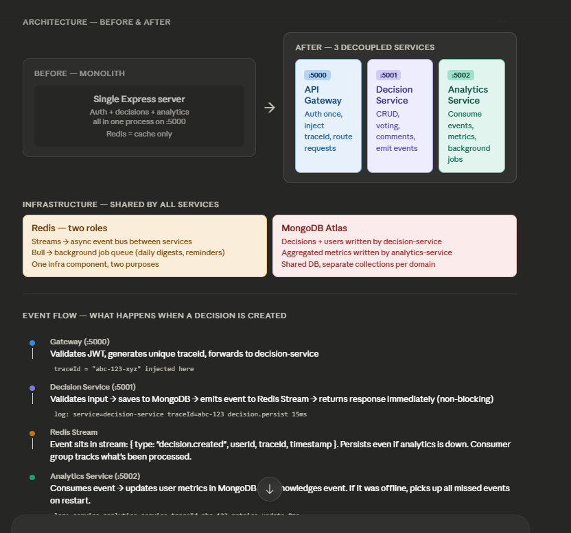
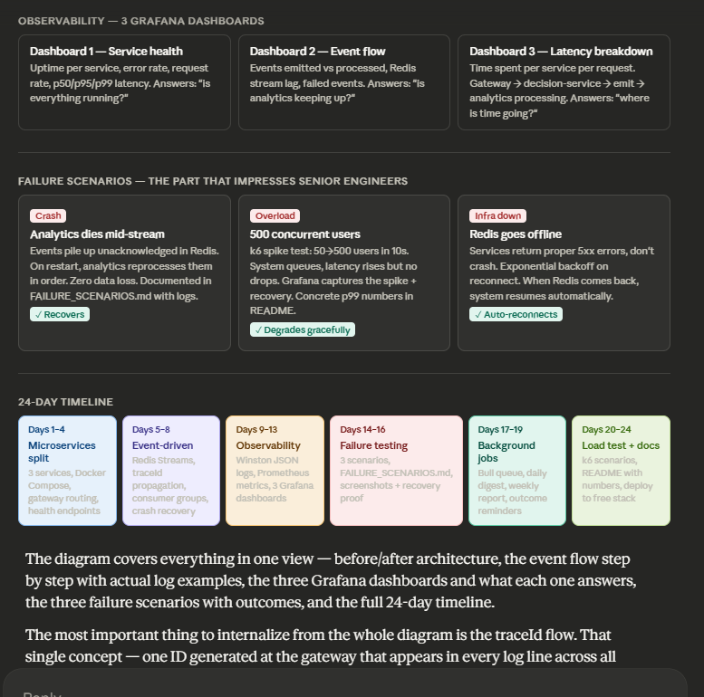

# Think-Twice: Distributed Backend Engineering Showcase — Complete Implementation Guide

## 📋 Table of Contents
1. [Project Overview](#project-overview)
2. [Phase 1: Microservices Refactoring](#phase-1-microservices-refactoring-days-1-4)
3. [Phase 2: Event-Driven Architecture](#phase-2-event-driven-architecture-days-5-8)
4. [Phase 3: Observability & Monitoring](#phase-3-observability--monitoring-days-9-13)
5. [Phase 4: Failure Scenarios & Resilience](#phase-4-failure-scenarios--resilience-days-14-16)
6. [Phase 5: Async Jobs & Background Processing](#phase-5-async-jobs--background-processing-days-17-19)
7. [Phase 6: Load Testing & Documentation](#phase-6-load-testing--documentation-days-20-24)
8. [Interview Talking Points](#interview-talking-points)
9. [Deployment Strategy](#deployment-strategy)

---

## Project Overview

### What You're Building

You're transforming your existing monolithic Express backend into a **distributed, event-driven system** that demonstrates production-grade backend engineering. This isn't about adding features—it's about proving you understand how systems at Google, Amazon, and Stripe work.

**Current state:** Single Express server (monolith), all logic together  
**Target state:** 3 decoupled services communicating asynchronously via Redis Streams

### Why This Matters

Your internship proves you can build features in a multi-tenant SaaS. This project proves you can engineer systems at scale. These are different, complementary skills.

**Companies care about:**
- ✓ Can you decouple systems without tight coupling?
- ✓ Can you handle failures gracefully (what happens when a service dies)?
- ✓ Can you observe complex systems (logs, metrics, tracing)?
- ✓ Do you think about scaling beyond "add more servers"?

This project answers all four.

### The Key Innovation: TraceId Propagation

Every request entering the system gets a unique ID at the gateway. This ID follows the request through every service, appearing in every log line, database query, and event.

**Why this matters in interviews:** When you create a decision and show your terminal with three services all logging the same traceId, you're demonstrating distributed tracing—something most junior engineers don't understand. That one demo is worth a thousand resume bullet points.

### Architecture at a Glance
Frontend (Vercel)
↓
API Gateway (port 5000) — single entry point, auth once, inject traceId
├→ Decision Service (port 5001) — CRUD decisions, emit events
├→ Analytics Service (port 5002) — listen to events, calculate metrics
└→ Shared infrastructure: Redis (Streams + Bull), MongoDB

Services don't talk to each other directly. They communicate via Redis Streams (event queue). If Analytics crashes, decisions still work. Analytics queues up all missed events and processes them when it restarts.

---

## Phase 1: Microservices Refactoring (Days 1-4)

### Goal
Split your single Express server into 3 separately deployable services, each with its own port and .env file, coordinating through shared MongoDB and Redis.

### Why This Architecture?

**Service boundaries matter.** Right now, if you want to scale decision creation separately from analytics, you can't. Everything is in one process. By splitting, you can:
- Deploy decision-service 10 times if needed
- Scale analytics-service independently based on load
- Restart one service without affecting others

### The Three Services

#### 1. API Gateway (Port 5000)
**Purpose:** Single entry point, auth once, route requests.

**Owns:**
- Validate JWT tokens (do this once at the gateway, not in every service)
- Inject traceId into every request (unique ID for this request's journey)
- Route `/decisions/*` to decision-service (port 5001)
- Route `/analytics/*` to analytics-service (port 5002)
- Route `/auth/*` to decision-service (auth lives in decision service)
- Handle CORS, cookies, headers

**Does NOT own:**
- Business logic
- Database queries
- Event emission

**Why this pattern:** Traditional monoliths do auth in every endpoint. Microservices do it once at the gate. This reduces code duplication and ensures consistent auth behavior.

#### 2. Decision Service (Port 5001)
**Purpose:** All decision-related operations.

**Owns:**
- Decision CRUD (create, read, update, delete)
- Options management (edit options on decisions)
- Voting logic (users vote on options)
- Confidence levels (users record confidence in a decision)
- Comments (users comment on decisions)
- Search for decisions (using MongoDB text search, not Elasticsearch)
- User authentication (login, register, JWT token generation)
- Emitting events to Redis Streams when decisions change

**Does NOT own:**
- Analytics calculations
- Outcome tracking (that's analytics)
- Predictions or aggregations

**Why separate:** Decision creation is a write-heavy operation. Analytics is read-heavy and computation-intensive (especially if you add ML predictions later). By separating, you can optimize and scale each differently.

#### 3. Analytics Service (Port 5002)
**Purpose:** Listen to decision events, calculate metrics.

**Owns:**
- Subscribing to Redis Streams events
- Calculating per-user metrics (average confidence, success rate, category breakdown)
- Recording user outcomes (did the decision work out?)
- Storing aggregated metrics in MongoDB
- Running background jobs (daily digests, weekly reports)
- Providing `/metrics/:userId` endpoint

**Does NOT own:**
- Creating or modifying decisions
- Returning raw decisions (only aggregated metrics)

**Why separate:** This service is purely a consumer of events. It reads what happens in decision-service, calculates insights, stores results. If it crashes, decisions still work. It catches up on reboot.

### Migration Path

Your current `server/` folder becomes `services/decision-service/`. The monolith is now broken into pieces:
OLD structure:
server/
├── controllers/ (auth, decision, analytics all mixed)
├── routes/ (auth, decision, analytics all mixed)
├── models/
└── server.js (one port 5000)

NEW structure:
services/
├── api-gateway/ (new, port 5000)
├── decision-service/ (your old server/, port 5001)
├── analytics-service/ (new, port 5002)
└── shared/ (utility files both services use)

### What Each Service Needs

Each service is basically a mini-Express app. They all have:
- `server.js` (port definition, app startup)
- `.env` (configuration, port, MongoDB URI, Redis URL)
- `package.json` (dependencies)
- `/health` endpoint (so monitoring knows they're alive)
- Routes for their domain
- Controllers for business logic
- Connection to shared MongoDB

Decision-service has the most complexity (all your existing logic). Analytics-service starts simple (just placeholder endpoints that will be filled in Phase 2).

### Docker Compose Update

Your existing Docker Compose had one backend service. Now it has three:
What changes:

Add decision-service container
Add analytics-service container
Add api-gateway container
Keep redis, mongodb
Services talk to each other inside the Docker network by hostname, not localhost:
e.g., api-gateway talks to http://decision-service:5001 (not localhost:5001)

### Frontend Changes

Your frontend currently points to `http://localhost:5000`. It still does. But now port 5000 is the gateway, not decision-service. The gateway proxies requests to the real services. Frontend doesn't care—it still talks to one URL.

### Verification Checklist

After Phase 1, you should be able to:
- [ ] Start `docker-compose up` and see all 3 services boot
- [ ] Hit `http://localhost:5000/health` → returns gateway health
- [ ] Hit `http://localhost:5000/auth/login` with credentials → proxies to decision-service, auth works
- [ ] Create a decision via UI → still works, decision-service processes it
- [ ] Hit `http://localhost:5000/analytics/metrics/user-id` → analytics-service returns metrics (placeholder so far)
- [ ] Restart decision-service in Docker → analytics-service keeps running, decisions resume working after restart
- [ ] Check MongoDB → same data structure, no migrations needed

### Timeline: 4 Days
- Day 1: Create folder structure, move existing code to decision-service, update Docker Compose
- Day 2: Build API gateway service, test routing
- Day 3: Create analytics-service skeleton, test all three services together
- Day 4: Ensure frontend works, clean up logging, finalize .env files

---

## Phase 2: Event-Driven Architecture (Days 5-8)

### Goal
Connect the three services via Redis Streams so they communicate asynchronously. When a decision is created in decision-service, it emits an event. Analytics-service listens and automatically updates metrics.

### The Problem This Solves

**Without events (current monolith):**
User creates decision → decision-service saves to DB → manually call analytics code → return response
(All synchronous, if analytics calculation fails, user sees error)
User creates decision → decision-service saves to DB → emit event to Redis → return response immediately
(Async, analytics picks up event in background, no blocking)

### Redis Streams: What It Is

Think of Redis Streams as a log file that multiple applications can read. It's like:
- A queue for events (messages don't disappear after being read)
- Persistent (survives server restarts if configured)
- Consumer groups (multiple processes can read same stream, each tracks their position)
- ACK mechanism (mark events as processed; unprocessed events persist and get replayed)

**Key difference from a regular queue:** Regular queues delete messages once processed. Redis Streams keeps them, allowing replay and recovery.

### Event Types You'll Emit

When things happen in decision-service, emit to Redis Stream:

**decision:created** 
- Fired: When user creates a new decision
- Contains: decision ID, user ID, title, category, confidence level, timestamp, traceId
- Purpose: Analytics-service listens, adds to user's decision count, updates metrics

**decision:updated**
- Fired: When user edits a decision
- Contains: decision ID, what changed (title, category, confidence), timestamp, traceId
- Purpose: Analytics-service recalculates metrics

**decision:deleted**
- Fired: When decision is removed
- Contains: decision ID, user ID, timestamp, traceId
- Purpose: Analytics removes from count

**outcome:recorded**
- Fired: When user submits "did this decision work out? Yes/No"
- Contains: decision ID, outcome (success/failure/pending), timestamp, traceId
- Purpose: Analytics recalculates success rate

### Emitting Events from Decision-Service

When decision-service runs, it has a module that sends events to Redis Streams. Example flow:
User submits form to create decision
↓
decision-service receives request
↓
Validates input
↓
Saves to MongoDB
↓
Emit to Redis: { stream: "decisions", message: { id, userId, title, ... } }
↓
Return response to user immediately

Analytics-service starts
↓
Connect to Redis
↓
Join as consumer group "analytics-consumer"
↓
Continuously check: "any new events in 'decisions' stream?"
↓
When event arrives:

Update user's metrics in MongoDB
Mark event as processed (acknowledge)
↓
If the service crashes mid-process:
On restart, check Redis: "what events haven't been acknowledged?"
Reprocess those events
No data loss, no duplicates
User submits decision
↓
Gateway: traceId = "abc-123-xyz" (generated here)
↓
Request → decision-service (traceId attached in header)
↓
decision-service logs: "[decision-service] traceId=abc-123-xyz decision.created"
↓
Emit event to Redis (traceId in the event payload)
↓
Analytics-service receives event with traceId
↓
Analytics logs: "[analytics-service] traceId=abc-123-xyz metrics.updated"

Frontend (user creates decision)
↓
Gateway (generates traceId=abc-123)
↓
Decision-Service:

Save to MongoDB
Emit event: { decision.created, traceId=abc-123, ... }
Return response
↓
Redis Stream (events queue)
↓
Analytics-Service (listening):
Receive event
Update user's metrics in MongoDB
Acknowledge event
Log: traceId=abc-123 metrics updated
timestamp=2024-03-14T10:15:23Z service=gateway level=INFO message="request.start" traceId=abc-123 method=POST path=/decisions userId=user-1
timestamp=2024-03-14T10:15:23Z service=decision-service level=INFO message="decision.validate" traceId=abc-123 duration=2ms
timestamp=2024-03-14T10:15:23Z service=decision-service level=INFO message="decision.persist" traceId=abc-123 duration=15ms
timestamp=2024-03-14T10:15:23Z service=decision-service level=INFO message="event.emit" traceId=abc-123 stream=decisions duration=1ms
timestamp=2024-03-14T10:15:24Z service=decision-service level=INFO message="response.sent" traceId=abc-123 statusCode=201 duration=20ms
timestamp=2024-03-14T10:15:25Z service=analytics-service level=INFO message="event.received" traceId=abc-123 eventType=decision.created
timestamp=2024-03-14T10:15:25Z service=analytics-service level=INFO message="metrics.update" traceId=abc-123 duration=8ms

Subject: Your Daily Decision Digest

Hey Himanshu,

Today you made 3 decisions:

Career (2): Both pending outcome
Personal (1): Successful
Your success rate this week: 45%

Check back tomorrow for results!

Subject: Your Weekly Decision Impact Report

Great news! Your success rate improved to 52% (was 45% last week).

Categories you're best at: Career (70% success), Health (60%)
Areas to focus: Relationships (20%)

You tend to make decisions fastest on Mondays.
You're most successful when you have >80% confidence.

Subject: Follow-up: Did your decision work out?

Hi Himanshu,

A week ago you decided to "Switch teams at work".
How did it turn out?

Record your outcome here: [link]

This helps us improve your decision-making over time!

"0 6 * * *" → every day at 6 AM
"0 8 * * 0" → every Sunday at 8 AM
"7 days from creation" → relative to a specific event

Scenario	Users	Duration	Success Rate	p50	p95	p99
Baseline	100	60s	100%	45ms	120ms	250ms
Heavy	300	60s	99%	80ms	300ms	550ms
Spike	50→500	40s	98%	120ms	400ms	800ms
docker-compose up

All three services, Redis, MongoDB start
Frontend on 3000, Gateway on 5000
This comprehensive README covers all phases in detail without code. You can now reference this while building. Each phase is clearly outlined with:

What to build
Why it matters
What to verify
Timeline expectations
Interview value
Copy this into docs/README.md and you have your complete roadmap.

Claude Haiku 4.5 • 1x

The emit is non-blocking (doesn't wait for analytics to process). User gets response fast.

### Consuming Events in Analytics-Service

Analytics-service runs a background consumer that listens to Redis Streams:

The emit is non-blocking (doesn't wait for analytics to process). User gets response fast.

### Consuming Events in Analytics-Service

Analytics-service runs a background consumer that listens to Redis Streams:
nalytics-service starts
↓
Connect to Redis
↓
Join as consumer group "analytics-consumer"
↓
Continuously check: "any new events in 'decisions' stream?"
↓
When event arrives:

Update user's metrics in MongoDB
Mark event as processed (acknowledge)
↓
If the service crashes mid-process:
On restart, check Redis: "what events haven't been acknowledged?"
Reprocess those events
No data loss, no duplicates

### The Critical Feature: Consumer Groups and Recovery

This is what makes your system resilient. If analytics-service crashes while updating metrics:

1. Event sits in Redis marked pending (not acknowledged)
2. Restart analytics-service
3. It checks: "what's pending from my consumer group?"
4. Retrieves and reprocesses those events
5. **No events lost, no duplicates**

This is the difference between "I made microservices" and "I understand distributed systems."

### TraceId Propagation

Every request entering the gateway gets a unique ID. This ID travels with the request through all services and appears in every log.

**Flow:**
User submits decision
↓
Gateway: traceId = "abc-123-xyz" (generated here)
↓
Request → decision-service (traceId attached in header)
↓
decision-service logs: "[decision-service] traceId=abc-123-xyz decision.created"
↓
Emit event to Redis (traceId in the event payload)
↓
Analytics-service receives event with traceId
↓
Analytics logs: "[analytics-service] traceId=abc-123-xyz metrics.updated"

When you grep logs for "abc-123-xyz", you see the entire journey of that request across all services. In interviews, this single demo is incredibly impressive.

### Data Flow Diagram
rontend (user creates decision)
↓
Gateway (generates traceId=abc-123)
↓
Decision-Service:

Save to MongoDB
Emit event: { decision.created, traceId=abc-123, ... }
Return response
↓
Redis Stream (events queue)
↓
Analytics-Service (listening):
Receive event
Update user's metrics in MongoDB
Acknowledge event
Log: traceId=abc-123 metrics updated

### What Gets Stored Where

**MongoDB:**
- Decisions (by decision-service)
- Outcomes (by analytics-service, when user records if decision worked)
- Analytics metrics (by analytics-service, aggregated summary)
- User profiles, auth info (by decision-service)

**Redis Streams:**
- Events (decision.created, decision.updated, outcome.recorded)
- Each event is immutable; consumers track their position

**In Memory (app state):**
- Nothing important; everything persists to DB

### Verification Checklist

After Phase 2, you should see:

- [ ] Create a decision and watch the event flow in real-time
- [ ] Grep logs by traceId and see the journey: Gateway → Decision-Service → Redis → Analytics-Service
- [ ] Kill analytics-service while events are flowing
- [ ] Events accumulate in Redis (unacknowledged)
- [ ] Restart analytics-service
- [ ] It reprocesses all pending events without duplicates
- [ ] Check MongoDB analytics collection → metrics updated correctly

### Timeline: 4 Days
- Day 5: Design event schema, implement event emission in decision-service
- Day 6: Build Redis Streams connection, emit working events
- Day 7: Build consumer in analytics-service, listen and process events
- Day 8: Implement traceId propagation, test recovery scenario, add logging

---

## Phase 3: Observability & Monitoring (Days 9-13)

### Goal
Instrument your system with structured logging, metrics, and dashboards so you can see what's happening and prove performance under load.

### Why This Matters

**Without observability:** You can't debug. Service is slow? No idea why. Event processing lagging? You don't know.

**With observability:** Create a decision, grep your logs for its traceId, see exactly where time was spent. Slow analytics? Grafana dashboard shows it. Redis overloaded? Metrics spike.

### Three Layers of Observability

#### 1. Structured Logging (Winston)

Replace console.log everywhere with structured JSON logs. Every log line includes:
- timestamp (when it happened)
- service (which service logged it)
- level (INFO, ERROR, WARN, DEBUG)
- message (what happened)
- traceId (which request)
- userId (which user)
- durationMs (how long did it take)
- custom fields (specific to the event)

**Example logs for creating a decision:**
timestamp=2024-03-14T10:15:23Z service=gateway level=INFO message="request.start" traceId=abc-123 method=POST path=/decisions userId=user-1
timestamp=2024-03-14T10:15:23Z service=decision-service level=INFO message="decision.validate" traceId=abc-123 duration=2ms
timestamp=2024-03-14T10:15:23Z service=decision-service level=INFO message="decision.persist" traceId=abc-123 duration=15ms
timestamp=2024-03-14T10:15:23Z service=decision-service level=INFO message="event.emit" traceId=abc-123 stream=decisions duration=1ms
timestamp=2024-03-14T10:15:24Z service=decision-service level=INFO message="response.sent" traceId=abc-123 statusCode=201 duration=20ms
timestamp=2024-03-14T10:15:25Z service=analytics-service level=INFO message="event.received" traceId=abc-123 eventType=decision.created
timestamp=2024-03-14T10:15:25Z service=analytics-service level=INFO message="metrics.update" traceId=abc-123 duration=8ms

Grep by traceId and you see the entire request journey with timings. Interview gold.

#### 2. Prometheus Metrics

Instrument these specific metrics:

**Request metrics:**
- `http_requests_total` — total requests per service, per route, per status (200, 400, 500)
- `http_request_duration_ms` — histogram of request latencies (p50, p95, p99 percentiles)

**Event stream metrics:**
- `redis_stream_lag` — how many unprocessed events sit in queue (should be near 0)
- `redis_stream_processing_duration_ms` — how long it takes analytics to process each event
- `events_emitted_total` — events created per type
- `events_processed_total` — events successfully processed per type
- `events_failed_total` — events that failed processing

**Database metrics:**
- `mongodb_query_duration_ms` — time spent in database calls
- `mongodb_queries_total` — query count

These metrics are the backbone of your Grafana dashboards. They answer questions like: "How fast is the system?" "Is event processing lagging?" "Are there errors?"

#### 3. Grafana Dashboards

Three dashboards that tell your story:

**Dashboard 1: Service Health**
What's the status of the system right now?

Panels:
- Uptime per service (is it running?)
- Error rate per service (what % of requests fail?)
- Request rate per service (how much traffic?)
- Response latency (p50, p95, p99)

Tells the story: "All three services are running, response time is good, no errors."

**Dashboard 2: Event Flow**
How are events moving through the system?

Panels:
- Events emitted vs processed per minute
- Events failed per minute
- Redis stream lag over time (pending events)
- Processing latency per event type

Tells the story: "Events are flowing, analytics keeps up, no backlog."

**Dashboard 3: Latency Breakdown**
Where does time get spent?

Panels:
- Request time at gateway
- Processing time in decision-service
- Time to emit event
- Processing time in analytics-service
- End-to-end latency

Tells the story: "User perception is <100ms. Decision-service spends 20ms. Event processing is 5ms."

### Why These Dashboards

When you show these in interviews alongside your code, you're proving:
- You think about performance (measured, not guessed)
- You understand bottlenecks (where time is actually spent)
- You designed for observability (not an afterthought)

Most junior engineers write code and hope it works. You measured it.

### What Gets Logged

Every significant operation:
- Request starts (method, URL, user, traceId)
- Validation happens (what was checked?)
- Database queries (table, duration)
- Events emitted (stream, duration)
- Events processed (consumer, duration, success/failure)
- Errors occur (stack trace, context)
- Request completes (status code, total duration)

Not every tiny operation (too much noise), but every business-relevant event.

### Local Development

During development, logs print to console as JSON. You can still read them (tools exist to pretty-print JSON logs). In production, they get shipped to a log aggregation service (Elasticsearch, CloudWatch, etc.), but for your demo, console is fine.

### Verification Checklist

After Phase 3:

- [ ] Create a decision and grep logs for its traceId
- [ ] See the full request journey across services with timings
- [ ] Prometheus scrapes metrics from all services
- [ ] Grafana dashboards load and show real data
- [ ] Dashboard 1 shows service health metrics
- [ ] Dashboard 2 shows event flow and stream lag
- [ ] Dashboard 3 shows latency breakdown per service
- [ ] Kill a service, watch error rate spike on dashboard
- [ ] Restart service, error rate drops

### Timeline: 5 Days
- Day 9: Instrument decision-service with structured logging and metrics
- Day 10: Instrument analytics-service, set up Prometheus scraping
- Day 11: Build Grafana service health dashboard
- Day 12: Build Grafana event flow dashboard
- Day 13: Build Grafana latency breakdown dashboard, take screenshots for README

---

## Phase 4: Failure Scenarios & Resilience (Days 14-16)

### Goal
Deliberately break things in controlled ways, document what happens, and prove your system recovers.

### Why This Matters

**Interview question you'll face:** "Tell me about a time something failed in production. How did you handle it?"

This phase gives you a concrete, technical answer with proof.

### Three Failure Scenarios

#### Scenario 1: Analytics Service Crashes Mid-Stream

**What you do:**
1. Start the system normally (all three services, Redis, MongoDB running)
2. Create several decisions through the UI (events flow to Redis Streams)
3. While events are being processed, kill the analytics-service container
4. Create more decisions (they pile up in Redis, unacknowledged)
5. Restart analytics-service
6. Watch it pick up exactly where it left off
7. Verify all events processed, metrics updated correctly

**What you observe:**
- The system stays up (decisions still created)
- Events accumulate in Redis (you can see pending count spike)
- When analytics restarts, it gets pending events from Redis
- It reprocesses them in order (with proper ordering)
- Final metrics are correct (no data loss)

**Documentation:** Take screenshots showing:
- Redis stream lag before crash
- Lag spike during crash
- All events processed correctly after restart
- Timestamp comparisons proving order preservation

**Interview story:** "When a service crashes, events don't get lost—they sit in Redis. On restart, the service picks up from where it left off using consumer groups. I tested this by killing analytics mid-processing and verifying all events were reprocessed correctly."

#### Scenario 2: Gateway Overload

**What you do:**
1. Start the system
2. Use k6 or autocannon to hit the gateway with 500 concurrent requests for 30 seconds
3. Monitor Grafana dashboards during the spike
4. Verify no requests are dropped
5. Check error rate (should be 0 or near 0)
6. Check latency under load (p99 should still be reasonable)

**What you observe:**
- Request queue builds up (services buffer requests)
- Latency increases under load but doesn't fail
- All services handle load gracefully
- No timeouts, no drops
- When load subsides, queue drains

**Documentation:** Capture Grafana screenshots showing:
- Request rate spike
- Latency impact (p50, p95, p99)
- No error spikes
- Resource utilization

**Interview story:** "I stress-tested with 500 concurrent users. The architecture queued requests gracefully, p99 latency increased as expected, but no requests failed. This proves the system scales and fails gracefully under overload."

#### Scenario 3: Redis Goes Down Briefly

**What you do:**
1. Start the system
2. Create a decision (flows through system normally)
3. Stop Redis container
4. Try to create another decision
5. Verify system returns proper error (not crash, not hang)
6. Verify services implement exponential backoff on reconnection
7. Restart Redis
8. Try creating decision again (works)

**What you observe:**
- Redis failure doesn't crash services
- Services return 5xx errors (proper HTTP semantics)
- Services didn't lose state (next request works)
- Exponential backoff prevents log spam
- System recovers when Redis comes back

**Documentation:**
- Log output showing retry attempts with backoff
- Timestamp showing recovery time
- Error response from API during outage

**Interview story:** "When infrastructure fails, the system should fail gracefully, not crash. I simulated Redis downtime and verified services returned proper errors and automatically reconnected with exponential backoff when it came back up."

### FAILURE_SCENARIOS.md Document

Create a document in your repo that details each scenario:

**For each scenario:**
- Problem statement (e.g., "What if analytics-service crashes while processing events?")
- Expected behavior (what should happen ideally?)
- What you actually tested
- How you tested it (steps)
- What you observed (actual behavior with logs/metrics)
- If there was a gap, what you fixed
- Screenshots/logs proving it works

This document is what makes hiring managers think "this person understands distributed systems, not just tutorials."

### What Differentiates Good Engineers

❌ Bad: "I built microservices"  
✓ Good: "I built microservices and tested failure scenarios"  
✓✓ Expert: "I built microservices, tested specific failure scenarios, documented recovery behavior, measured impact with dashboards"

You're going for ✓✓.

### Verification Checklist

After Phase 4:

- [ ] FAILURE_SCENARIOS.md document exists with all three scenarios documented
- [ ] Scenario 1: Analytics crash → recovery proven with event reprocessing  
- [ ] Scenario 2: Overload test → 500 concurrent users handled gracefully
- [ ] Scenario 3: Redis downtime → proper error handling and recovery
- [ ] Grafana screenshots show metrics during each scenario
- [ ] Logs demonstrate traceId tracking through failures
- [ ] No data loss in any scenario
- [ ] README references FAILURE_SCENARIOS.md prominently

### Timeline: 3 Days
- Day 14: Design and execute Scenario 1 (crash recovery), document with screenshots
- Day 15: Design and execute Scenario 2 (overload test), capture Grafana metrics
- Day 16: Design and execute Scenario 3 (Redis failure), document recovery behavior

---

## Phase 5: Async Jobs & Background Processing (Days 17-19)

### Goal
Implement Bull (Redis-backed job queue) for background tasks that don't need to happen immediately.

### Why Background Jobs?

Some operations shouldn't block user requests:
- Sending emails (slow, might fail)
- Aggregating analytics (computationally expensive)
- Generating reports (takes time)

Put these on a queue: "send me an email at 6 AM every day" or "generate today's digest when you get a chance."

### Three Background Jobs

#### Job 1: Daily Digest
**What:** Aggregates all decisions from the last 24 hours, sends email summary

**When:** Every day at 6 AM

**What it does:**
- Query all decisions created in last 24 hours
- Group by category
- Count successful vs pending vs failed outcomes
- Call analytics-service to get aggregated metrics
- Format a nice email
- Send via Gmail SMTP

**Example email:**
Subject: Your Daily Decision Digest

Hey Himanshu,

Today you made 3 decisions:

Career (2): Both pending outcome
Personal (1): Successful
Your success rate this week: 45%

Check back tomorrow for results!

#### Job 2: Weekly Impact Report
**What:** Shows trends, patterns, success metrics for the week

**When:** Every Sunday at 8 AM

**What it does:**
- Aggregate all decisions from last 7 days
- Calculate success rate trend (this week vs last week)
- Identify most common categories
- Show which types of decisions you succeed at
- Alert on recommendations

**Example email:**
Subject: Your Weekly Decision Impact Report

Great news! Your success rate improved to 52% (was 45% last week).

Categories you're best at: Career (70% success), Health (60%)
Areas to focus: Relationships (20%)

You tend to make decisions fastest on Mondays.
You're most successful when you have >80% confidence.

Subject: Follow-up: Did your decision work out?

Hi Himanshu,

A week ago you decided to "Switch teams at work".
How did it turn out?

Record your outcome here: [link]

This helps us improve your decision-making over time!

"0 6 * * *" → every day at 6 AM
"0 8 * * 0" → every Sunday at 8 AM
"7 days from creation" → relative to a specific event

Scenario	Users	Duration	Success Rate	p50	p95	p99
Baseline	100	60s	100%	45ms	120ms	250ms
Heavy	300	60s	99%	80ms	300ms	550ms
Spike	50→500	40s	98%	120ms	400ms	800ms
docker-compose up

All three services, Redis, MongoDB start
Frontend on 3000, Gateway on 5000
This comprehensive README covers all phases in detail without code. You can now reference this while building. Each phase is clearly outlined with:

What to build
Why it matters
What to verify
Timeline expectations
Interview value
Copy this into docs/README.md and you have your complete roadmap.

Claude Haiku 4.5 • 1x

#### Job 3: Outcome Reminder
**What:** 7 days after creating a decision, reminds user to record the outcome

**When:** Scheduled 7 days after decision creation

**What it does:**
- Find all decisions created 7 days ago
- For those without outcomes recorded, send reminder email
- Include link to record outcome

**Example email:**
Subject: Follow-up: Did your decision work out?

Hi Himanshu,

A week ago you decided to "Switch teams at work".
How did it turn out?

Record your outcome here: [link]

This helps us improve your decision-making over time!

### Bull Dashboard

Bull provides a visual interface to see:
- Jobs queued (waiting to run)
- Jobs in progress (currently running)
- Jobs completed (successfully processed)
- Jobs failed (errored out)

A single Grafana panel can show job queue depth and processing rate, tying into your observability stack.

### Job Scheduling

Bull supports cron syntax:
"0 6 * * *" → every day at 6 AM
"0 8 * * 0" → every Sunday at 8 AM
"7 days from creation" → relative to a specific event

### Integration Points

**Email backend:** Gmail SMTP (free, no signup needed for test)

**Why Gmail?** Your email service. For production, use Mailgun or SendGrid, but for demo, Gmail works.

**Queue backend:** Shared Redis (same Redis instance that runs event streams)

This is architecturally nice: one infrastructure component (Redis) serving two purposes:
- Event streaming (Redis Streams)
- Job queuing (Bull)

That's conscious design, not accident. Worth mentioning in interviews.

### Verification Checklist

After Phase 5:

- [ ] Daily digest job runs at scheduled time
- [ ] Weekly report job runs and calculates correct metrics
- [ ] Outcome reminder triggers 7 days after decision
- [ ] Emails send successfully (check Gmail inbox)
- [ ] Bull dashboard shows job queue status
- [ ] Grafana has panel showing job queue depth
- [ ] Failed jobs are retried with backoff
- [ ] Job logs include traceId for debugging

### Timeline: 3 Days
- Day 17: Design job schemas, set up Bull, implement daily digest
- Day 18: Implement weekly report and outcome reminder
- Day 19: Test all three jobs, verify email delivery, integrate into Grafana

---

## Phase 6: Load Testing & Documentation (Days 20-24)

### Goal
Prove performance under realistic load with numbers, finalize documentation, prepare for deployment and interviews.

### Load Testing with K6

K6 is a simple load testing tool. You write a script that simulates users.

**What you'll test:**

**Scenario A: Baseline (100 concurrent users, 60 seconds)**
- Expected: All requests succeed, p99 latency <500ms
- Proves baseline performance

**Scenario B: Heavy Load (300 concurrent users, 60 seconds)**
- Expected: Still handles, latency increases but no failures
- Proves scalability

**Scenario C: Spike Test (ramp 50→500 users in 10s, hold 30s, ramp down)**
- Expected: System recovers after spike, no data loss
- Proves resilience

### Metrics to Capture

From each test scenario:
- Requests per second
- Success rate (% succeeded / failed)
- Latency p50, p95, p99 per service
- Error types and counts
- Redis stream lag during load
- Event processing latency during load

### Documentation: Updated README

Your top-level README should include:

**1. Architecture Diagram**
Visual of: Gateway → Decision-Service, Analytics-Service ← Redis, MongoDB

**2. Why These Decisions**
- "Why microservices instead of monolith?" — Scalability, independent deployments
- "Why Redis Streams instead of Kafka?" — Simpler, free, built-in Persistence
- "Why traceId everywhere?" — Debugging distributed requests

**3. Event Flow Walkthrough**
Step-by-step: user creates decision → what happens in each service → how it appears in logs → final outcome

**4. Failure Handling**
Link to FAILURE_SCENARIOS.md, quick summary of what you tested

**5. Observability**
Screenshots of Grafana dashboards showing:
- Service health under normal load
- Event flow metrics
- Latency breakdown

**6. Load Test Results**
Table with results:

**8. Deployment (see separate section below)**

**9. Interview Talking Points**
Summary of what this project demonstrates

### Architecture Diagram

Use Excalidraw (free online):
- Three service boxes, clearly labeled
- Redis in center with arrows showing event flow
- Bull queue shown separately from Redis Streams  
- Frontend box connected to gateway
- MongoDB at the bottom
- Arrows showing direction of communication

Hand-drawn style is honestly more impressive than machine-generated.

### What This Phase Proves

Hiring managers evaluating your project will see:
- ✓ You thought about load (not just happy path)
- ✓ You measured performance (concrete numbers, not estimates)
- ✓ You have reproducible tests (anyone can re-run and see same results)
- ✓ You documented everything (clear instructions)
- ✓ You understand system limits (p99 under load, what breaks first)

### Verification Checklist

After Phase 6:

- [ ] Load test scripts run against local system
- [ ] All three scenarios complete successfully
- [ ] Metrics captured and documented in README
- [ ] Architecture diagram drawn and included
- [ ] README fully updated with all phases documented
- [ ] FAILURE_SCENARIOS.md referenced and linked
- [ ] Deployment guide complete
- [ ] Code is clean and commented
- [ ] All services have proper error handling
- [ ] Grafana dashboards are styled and labeled
- [ ] Screenshots embedded in README

### Timeline: 5 Days
- Day 20: Write load test scripts, run Scenario A (baseline)
- Day 21: Run Scenario B (heavy) and Scenario C (spike), capture metrics
- Day 22: Update README with architecture, event flow, failure scenarios
- Day 23: Add Grafana screenshots, load test results table
- Day 24: Final polish, test everything works end-to-end, push to GitHub

---

## Interview Talking Points

### Your 90-Second Elevator Pitch

"I refactored Think-Twice from a monolith into a 3-service event-driven architecture. Each request gets a traceId at the gateway and follows through all services—I can grep logs by that ID and see the entire request journey. Services communicate asynchronously via Redis Streams using consumer groups, so if analytics crashes mid-processing, events don't get lost—it picks up where it left off on restart. I deliberately tested failure scenarios: crashed the analytics service, simulated overload with 500 concurrent users, and killed Redis briefly. The system recovered gracefully every time. I have Grafana dashboards showing service health, event flow, and latency breakdown. Load tests show p99 latency under 250ms even at 300 concurrent users."

That's the answer that sets you apart.

### Questions You'll Likely Face

**Q: Why split into services?**
A: "Decoupling lets me scale independently. If decisions are write-heavy and analytics is computation-heavy, I can optimize and scale them separately. Plus, analytics crashes don't take down the whole system—decisions keep working."

**Q: How do you handle failures?**
A: "Redis Streams consumer groups with acknowledgments. When analytics processes an event, it claims it, processes it, then acknowledges. If it crashes mid-process, on restart it sees unacknowledged events and reprocesses them. I tested this explicitly—killed the service mid-operation and verified no events were lost."

**Q: How do you trace requests?**
A: "Every request gets a unique traceId at the gateway, travels with it through all services, appears in every log. Grep for one traceId and I see the entire journey with timings. That's how distributed debugging works at scale."

**Q: What would you change if you scaled further?**
A: "Right now one MongoDB for all services. At massive scale, I'd split per-service databases with eventual consistency. Redis Streams could become Kafka for higher throughput. I'd add a message broker pattern if services needed more complex workflows. But for this scope, the current design is optimal."

**Q: How did you measure performance?**
A: "k6 load tests with three scenarios: baseline 100 users, heavy 300 users, spike test ramping to 500. Prometheus captures latency histograms, Redis stream lag, event processing rate. Grafana dashboards visualize this in real-time."

### Why Hiring Managers Care About This

When you show:
1. **Microservices** → You understand service boundaries
2. **Event-driven async** → You get eventual consistency
3. **Failure testing** → You think about production, not just happy path
4. **Observable systems** → You can debug complex systems
5. **Load testing** → You measure, not guess

These are senior engineer skills, not junior. You're showing maturity.

---

## Deployment Strategy

### Free Stack

| Component | Platform | Cost | Why |
|-----------|----------|------|-----|
| Frontend | Vercel | $0 | Free tier at scale |
| API Gateway, Services | Render | $0 | 1 free instance (≤400 hours/month) |
| Database | MongoDB Atlas | $0 | Free tier 512MB storage |
| Redis | Upstash | $0 | Free tier 10K commands/day |
| Monitoring | Self-hosted on Render | $0 | Prometheus/Grafana in container |
| Email | Gmail SMTP | $0 | Free with account |

**Total monthly cost: $0**

### Important Render Note

Render free instances spin down after 15 minutes of inactivity. During a demo, this kills you (30-second cold start). Solution: Set up UptimeRobot (free) to ping your services every 10 minutes during your demo period. Keeps them warm.

### Architecture on Deployment

Same as local:
- Vercel frontend talks to Render API gateway on internet
- Gateway routes to other services on Render (private network)
- All services talk to MongoDB Atlas and Upstash Redis
- Prometheus/Grafana runs in container on Render

### Before Deploying

Ensure:
- All .env variables configured on each Render service
- MongoDB Atlas network access allows Render IPs  
- Upstash Redis connection string in environment variables
- Email credentials for Gmail SMTP configured
- Grafana admin password set securely

### How This Looks to Interviewer

You show:
- Code repository on GitHub (well-organized, clear commits)
- Live demo running on free infra
- Two Grafana dashboards showing real metrics
- Load test results table in README
- FAILURE_SCENARIOS.md with detailed documentation

That's a complete project, not just code.

---

## 24-Day Timeline Summary

| Days | Phase | Focus |
|------|-------|-------|
| 1-4 | Phase 1 | Split monolith into 3 services, Docker Compose, gateway routing |
| 5-8 | Phase 2 | Redis Streams events, traceId propagation, consumer groups |
| 9-13 | Phase 3 | Winston logging, Prometheus metrics, Grafana dashboards |
| 14-16 | Phase 4 | Test 3 failure scenarios, document recovery, create FAILURE_SCENARIOS.md |
| 17-19 | Phase 5 | Bull job queue, daily digests, weekly reports, outcome reminders |
| 20-24 | Phase 6 | Load testing (k6), update README, deploy, final polish |

**Total effort:** ~120-150 hours (6-8 hours per day)

---

## How to Use This Documentation

1. **Read this README first** — You're doing that now
2. **Create a simple checklist** from each phase
3. **Follow one phase at a time** — Don't jump ahead
4. **Test everythinglocally before moving on** — Use docker-compose
5. **Capture evidence as you go** — Screenshots, logs, metrics
6. **Document failures and fixes** — This is gold for interviews
7. **Update main README incrementally** — Add content as you build

---

## Final Thoughts

This project takes 24 days and puts you ahead of 95% of junior engineers from an architecture perspective. Most don't understand distributed systems. You will.

The key differentiators:
- **TraceId propagation** — Simple but incredibly powerful
- **Failure scenario testing** — Not just happy path
- **Detailed documentation** — FAILURE_SCENARIOS.md is your contract with reality

When you walk into an interview and say "I tested crash recovery with Redis Streams consumer groups" and can show Grafana dashboards and load test results, you've immediately distinguished yourself.

Good luck. This is going to be impressive.

PHASE 1: Microservices Refactoring (Days 1-4)
Goal
Split monolithic Express backend into 3 separate services, each deployable independently.

Why This Phase
Foundation for everything else. Can't do event-driven without service separation.

Detailed Tasks
Day 1: Directory Structure & Move Code
 Create folder structure:
 Copy server folder → services/decision-service/
 Keep models, controllers, routes, utils in decision-service
 Update decision-service server.js to use port 5001 (not 5000)
 Update decision-service package.json if needed
 Set up .env file for decision-service (MONGO_URI, REDIS_URL, JWT_SECRET, PORT=5001)
 Test decision-service runs independently: npm run dev on port 5001
Day 2: Create API Gateway
 Create api-gateway/ folder with new Express app
 Create api-gateway/server.js:
Listen on port 5000
Initialize Express, middleware (cors, cookieParser, JSON)
Add /health endpoint for monitoring
 Create api-gateway/middleware/auth.js:
Validate JWT from cookies
Load user from MongoDB
Attach user to request
 Create api-gateway/routes/ folder:
routes/auth.js — proxy to decision-service port 5001
routes/decisions.js — proxy to decision-service port 5001 (auth protected)
routes/analytics.js — proxy to analytics-service port 5002 (auth protected)
 Set up environment variables:
DECISION_SERVICE_URL=http://localhost:5001
ANALYTICS_SERVICE_URL=http://localhost:5002
JWT_SECRET
CORS_ORIGIN
 Test gateway routing:
Call POST /auth/login through gateway → reaches decision-service
Verify response comes back
 Create api-gateway/.env file
Day 3: Create Analytics Service (Skeleton) & Update Docker
 Create analytics-service/server.js:
Listen on port 5002
Add /health endpoint
Add placeholder GET /analytics/metrics/:userId endpoint
 Create analytics-service/package.json (basic: express, mongoose, dotenv)
 Create analytics-service/.env (PORT=5002, MONGO_URI, REDIS_URL)
 Update docker-compose.yml to include all three services:
api-gateway service (port 5000)
decision-service service (port 5001)
analytics-service service (port 5002)
Keep redis, mongodb
Set up environment variables for each
Set up dependencies (gateway depends on decision + analytics, etc.)
 Test Docker Compose: docker-compose up
All three services should start
Check logs show each service starting on correct port
Day 4: Integration & Testing
 Update frontend API base URL to point only to gateway (5000)
 Test full flow locally:
Start docker-compose up
Frontend on port 3000
Hit http://localhost:5000/health → gateway responds
Login through UI → proxies to decision-service ✓
Create decision through UI → proxies to decision-service ✓
Hit analytics endpoint → proxies to analytics-service ✓
 Verify databases:
MongoDB has user, decision documents (written by decision-service)
No cross-service communication issues
 Clean up logs and error handling
 Commit to git: "Phase 1: Microservices split"
Deliverables
✅ Three separate services running on different ports
✅ API Gateway routing requests correctly
✅ Docker Compose orchestrates all services
✅ Frontend still works end-to-end
✅ Each service has /health endpoint
Verification Checklist
 docker-compose up starts all three services without errors
 curl http://localhost:5000/health returns gateway health
 Login/register flow works
 Create decision works
 Analytics endpoint accessible
 No cross-service API calls (all through gateway)
 MongoDB shows documents from decision-service
 Logs show requests reaching correct services
PHASE 2: Event-Driven Architecture with Redis Streams (Days 5-8)
Goal
Connect services asynchronously via Redis Streams. When decision-service creates a decision, emit event. Analytics-service consumes and updates metrics.

Why This Phase
Decouples services completely. Analytics crashes? Decisions still work. Events queue up, analytics catches up when restarted.

Detailed Tasks
Day 5: Event Emission Infrastructure
 In decision-service/, create events/ folder:
emitter.js — module to emit events to Redis Streams
 Design event schemas (what data in each event?):
decision:created → { id, userId, title, category, confidence, traceId, timestamp }
decision:updated → { id, changes, traceId, timestamp }
decision:deleted → { id, userId, traceId, timestamp }
outcome:recorded → { decisionId, outcome, traceId, timestamp }
 Implement emitter.js:
Connect to Redis (use REDIS_URL from .env)
Implement emit(streamName, eventData) function
Log when events emitted (for debugging)
 Update decision controller methods to emit events:
createDecision() → after saving to DB, emit decision:created
updateDecision() → after update, emit decision:updated
deleteDecision() → after delete, emit decision:deleted
recordOutcome() → emit outcome:recorded
 Test event emission:
Create decision via UI
Check Redis: events in stream (use Redis CLI or tool)
Verify event has all correct fields
Day 6: TraceId Injection at Gateway
 Update api-gateway/middleware/ to add traceId middleware:
Generate UUID on every request (or extract from header if already present)
Attach to req.traceId
Pass to all downstream services via header x-trace-id
 Update gateway routing to include traceId in proxied requests:
All proxy calls include x-trace-id header
 Update decision-service to capture traceId:
Extract from request header x-trace-id
Include in all event emissions
Include in all logging
 Update analytics-service to capture traceId:
Extract from request header (when applicable)
Include in logging
 Test traceId flow:
Call gateway endpoint
Create decision
Grep logs for traceId
Should see: gateway logs, decision-service logs, all with same traceId
Should see event emitted with traceId
Next phase will verify analytics picks it up
Day 7: Event Consumer in Analytics Service
 In analytics-service/, create subscribers/ folder:
eventSubscriber.js — module to listen to Redis Streams
 Implement consumer group setup:
Connect to Redis
Create consumer group analytics-consumer on stream decisions
Set up for outcome stream as well
 Implement event processing logic:
Listen for events
Parse event data
Update MongoDB analytics collection with metrics
Acknowledge event (mark as processed)
Handle errors gracefully
 Implement recovery logic:
On service start, check for pending (unacknowledged) events
Reprocess pending events (implements crash recovery)
 Create Analytics MongoDB model:
userId, avgConfidence, decisionCount, successCount, failureCount, categoryBreakdown
 Test consumer:
Start analytics-service
Create decision from UI (emits event)
Watch analytics-service logs: event received, metrics updated
Check MongoDB analytics collection: metrics recorded
Kill analytics, check pending events in Redis
Restart analytics, verify it processes pending events
Day 8: Verify Event Flow & TraceId Propagation
 Full integration test:
Start all services via docker-compose up
Create decision via UI
Grep logs for traceId (should see in all services)
Check MongoDB: decision created, analytics metrics updated
Check Redis: events in stream, consumer acknowledged
 Test crash recovery:
Create several decisions (events emitted)
Kill analytics-service in Docker
Create more decisions (events accumulate)
Restart analytics-service
Verify it processes all pending events
Verify no duplicates in metrics
 Test event reliability:
Stop Redis
Try to create decision
Get proper error (service unavailable)
Restart Redis
Create decision again → works
 Document event flow in README:
ASCII diagram showing request → decision-service → emit event → analytics consumes
Show example traceId journey through logs
 Commit to git: "Phase 2: Event-driven architecture"
Deliverables
✅ Events emitted to Redis Streams when decisions change
✅ Analytics-service consumes events and updates metrics
✅ TraceId injected at gateway, flows through all services
✅ Consumer group recovery implemented
✅ Crash recovery tested and working
Verification Checklist
 Create decision → event appears in Redis stream
 Analytics-service receives event → updates metrics in MongoDB
 Grep logs by traceId → see entire journey: gateway → decision → analytics
 Kill analytics → create more decisions → events queue in Redis
 Restart analytics → processes all pending events without duplicates
 MongoDB analytics collection has correct metrics
 No errors in logs
 All three services running together in Docker
PHASE 3: Observability & Monitoring (Days 9-13)
Goal
Add structured logging, Prometheus metrics, and Grafana dashboards to see what's happening.

Why This Phase
Can't optimize what you don't measure. Dashboards prove performance under load.

Detailed Tasks
Day 9: Structured Logging with Winston
 Install Winston in all three services (dependency)
 Create logging utility in shared/logging.js:
Configure Winston to output JSON
Include fields: timestamp, service, level, message, traceId, userId, durationMs
 Update all services to use Winston instead of console.log:
api-gateway/middleware/: log requests with traceId
decision-service/controllers/: log CRUD operations, event emissions
analytics-service/subscribers/: log event processing
All errors logged with stack traces and traceId
 Test local:
Create decision
Check console logs appear as JSON
Grep by traceId: see entire flow
 Ensure all logs include:
Service name (which service logged it)
TraceId (request ID)
UserId (which user)
Duration (how long did it take)
Context (what operation)
Day 10: Prometheus Integration
 Install Prometheus client library in all services
 In each service, set up metrics:
http_requests_total (counter: total requests per route, status code)
http_request_duration_ms (histogram: request latency in milliseconds)
events_emitted_total (counter: events per type, from decision-service)
events_processed_total (counter: events per type per consumer, from analytics)
events_failed_total (counter: failed events)
redis_stream_lag (gauge: pending events in stream)
redis_stream_processing_duration_ms (histogram: milliseconds to process event)
 Set up /metrics endpoint on each service:
Returns Prometheus metrics in text format
This is what Prometheus scrapes
 Test metrics locally:
Create decision
Hit http://localhost:5001/metrics on decision-service
See http_requests_total incremented
See decision:created event count increased
 Set up Prometheus config file in monitoring/prometheus.yml:
Scrape targets: localhost:5000, localhost:5001, localhost:5002
Scrape interval: 15 seconds
Day 11: Prometheus & Grafana in Docker
 Add Prometheus service to Docker Compose:
Build from image
Mount prometheus.yml config
Expose port 9090
Target: scrape metrics from all three services
 Add Grafana service to Docker Compose:
Build from image
Expose port 3001 (port 3000 is frontend)
Add data source: Prometheus on http://prometheus:9090
 Test Docker setup:
docker-compose up
Hit http://localhost:9090 → Prometheus UI
Check targets: all three services showing
Check metrics: see timeseries data
Hit http://localhost:3001 → Grafana
Login (default admin/admin)
Verify Prometheus data source connected
Day 12: Build Grafana Dashboards (Part 1 & 2)
 Dashboard 1: Service Health

Panels:
Uptime per service (Prometheus: up metric)
Error rate per service (failed / total)
Request rate per second per service
Response latency p50, p95, p99 (from histogram)
Save as: "Service Health"
 Dashboard 2: Event Flow

Panels:
Events emitted per minute (decision:created, decision:updated, outcome:recorded)
Events processed per minute (analytics-service)
Events failed per minute
Redis stream lag over time (pending events)
Event processing latency p50, p95, p99
Save as: "Event Flow"
Day 13: Build Grafana Dashboard (Part 3) & Screenshots
 Dashboard 3: Latency Breakdown

Panels:
Request time at gateway (ms)
Processing time in decision-service (ms)
Time to emit event (ms)
Processing time in analytics-service (ms)
End-to-end latency (ms)
Breakdown pie chart showing where time is spent
Save as: "Latency Breakdown"
 Take screenshots:

Dashboard 1 (service health)
Dashboard 2 (event flow)
Dashboard 3 (latency)
Save to docs/screenshots/ folder
Reference in README
 Test dashboards:

Create several decisions
Watch metrics update on Grafana in real-time
Verify numbers make sense
Create API load (see metrics spike)
Verify dashboard captures load
 Commit to git: "Phase 3: Observability"

Deliverables
✅ Winston structured JSON logging in all services
✅ Prometheus metrics instrumented
✅ Prometheus and Grafana running in Docker
✅ Three Grafana dashboards showing key metrics
✅ Screenshots of dashboards in docs
Verification Checklist
 Logs are JSON format with traceId, userId, service, duration
 http://localhost:9090 shows all three services as targets
 Grafana dashboards load without errors
 Create decision → dashboards update in real-time
 All metrics visible and accurate
 Screenshots taken and clear
PHASE 4: Failure Scenarios & Resilience Testing (Days 14-16)
Goal
Deliberately break things, document recovery, prove system is resilient.

Why This Phase
Proves you understand production concerns. Most devs don't test failures.

Detailed Tasks
Day 14: Scenario 1 — Analytics Service Crash & Recovery
 Setup:
Start all services: docker-compose up
Monitor Grafana (have dashboard open)
Monitor logs (follow logs from all services)
 Test execution:
Create 3 decisions via UI (watch events flow)
Note: Redis stream states, analytics metrics updated
Kill analytics-service container: docker-compose kill analytics-service
Create 5 more decisions
Watch: Events emitted but analytics not processing (stream lag spike on Grafana)
Check Redis: Unacknowledged events queued (use Redis CLI)
Restart analytics-service: docker-compose up analytics-service
Watch logs: Service reconnects, reprocesses pending events
Verify: All 5 new decisions now in analytics metrics
Verify: No duplicates (count is correct)
 Document findings:
Screenshot: Grafana before crash (lag near 0)
Screenshot: Grafana during crash (lag spike)
Screenshot: Grafana after recovery (lag returns to 0)
Log excerpt: Pending events detected on restart
Log excerpt: Events reprocessed successfully
Timestamp comparison: show order preserved
 Write to FAILURE_SCENARIOS.md:
Scenario title: "Analytics Service Crash & Recovery"
Problem: Service dies, events sitting in stream
Expected: Events don't get lost
What we tested: Killed service mid-processing
Evidence: Screenshots + logs
Result: Events persisted, recovered on restart
Day 15: Scenario 2 — Gateway Overload Test
 Setup:
Install k6 (load testing tool): npm install -g k6
Create load-test.js script:
Simulates 500 concurrent users
Each user creates 2-3 decisions
Run for 30 seconds
Measure success rate, latency
Open Grafana dashboards before test
 Test execution:
Run k6 script: k6 run load-test.js
Watch Grafana:
Request rate spike
Latency increases (expected)
Error rate (should stay near 0)
Queue builds on gateway
Wait for test to complete
Check results: success%, p50/p95/p99 latencies
 Document findings:
Screenshot: Grafana during load spike
Screenshot: Request queue depth (queuing not dropping)
Output: k6 results (success rate, latency percentiles)
Log excerpt: Error handling (or no errors)
 Record metrics:
Requests per second at peak
Success rate (% succeeded / failed)
Latency p50, p95, p99
Error rate
 Write to FAILURE_SCENARIOS.md:
Scenario: "Gateway Overload with 500 Concurrent Users"
Expected: No requests dropped, latency increases gracefully
Evidence: k6 output + Grafana screenshots
Result: System handled load, no failures
Day 16: Scenario 3 — Redis Downtime & Recovery
 Setup:

All services running normally
Have logs open
 Test execution:

Create a decision (normal flow)
Stop Redis: docker-compose kill redis
Try to create another decision
Observe: Service returns error (HTTP 500 or similar)
Check logs: Redis connection error, exponential backoff attempting reconnection
Wait 10 seconds (retry attempts)
Restart Redis: docker-compose up redis
Watch logs: Connection reestablished
Try creating decision again: Works
Verify: No data lost, previous decisions still in DB
 Document findings:

Screenshot: Error response during Redis downtime
Log excerpt: Connection errors with backoff timestamps
Log excerpt: Reconnection successful
Timestamps showing recovery time
 Write to FAILURE_SCENARIOS.md:

Scenario: "Redis Connection Loss & Recovery"
Expected: Graceful failure, automatic recovery
Evidence: Logs showing error handling + recovery
Result: System doesn't crash, recovers automatically
 Create comprehensive FAILURE_SCENARIOS.md:

Introduction: Why we test failures
Scenario 1: Full details + evidence
Scenario 2: Full details + evidence
Scenario 3: Full details + evidence
Conclusion: System is resilient
 Commit: "Phase 4: Failure scenarios tested & documented"

Deliverables
✅ Scenario 1: Analytics crash recovery documented with screenshots
✅ Scenario 2: Overload test with k6 and Grafana metrics
✅ Scenario 3: Redis downtime recovery with logs
✅ FAILURE_SCENARIOS.md document with all three scenarios
✅ Evidence: screenshots, logs, metrics
Verification Checklist
 FAILURE_SCENARIOS.md file exists and is comprehensive
 All three scenarios have detailed documentation
 Screenshots show metrics before, during, after each failure
 Logs demonstrate recovery mechanisms
 Load test shows 500 concurrent users handled
 No data loss in any scenario
 Recovery times documented
 README references FAILURE_SCENARIOS.md
PHASE 5: Async Jobs & Background Processing (Days 17-19)
Goal
Implement Bull job queues for background tasks (emails, reports) that don't block user requests.

Why This Phase
Proves you understand async processing. Real apps queue work instead of doing it synchronously.

Detailed Tasks
Day 17: Bull Setup & Daily Digest Job
 Install Bull in decision-service and analytics-service (npm dependency)
 Create bull/ folder in analytics-service/:
queues.js — Initialize Bull queues connected to Redis
dailyDigestJob.js — Define daily digest job
 Set up daily digest job:
Job name: dailyDigest
Schedule: Every day at 6 AM (cron: 0 6 * * *)
What it does:
Query decisions from last 24 hours
Group by category
Calculate success rate
Format email with summary
Send email via Gmail SMTP
Implement idempotency (don't send duplicate emails)
 Configure Gmail SMTP:
Use environment variable for Gmail app password
Implement Nodemailer transporter
Create email template
 Test job locally:
Trigger job manually (not wait for cron)
Check email received in Gmail
Verify data correct in email
Check MongoDB: job logged as completed
Day 18: Weekly Report & Outcome Reminder Jobs
 Implement weekly report job:

Job name: weeklyReport
Schedule: Every Sunday at 8 AM (cron: 0 8 * * 0)
What it does:
Aggregate decisions from last 7 days
Calculate success rate trend (vs previous week)
Identify top categories
Identify recommendations
Format email with insights
Send email
Test manually: trigger job, verify email
 Implement outcome reminder job:

Job name: outcomeReminder
Trigger: 7 days after decision creation
What it does:
Find decisions created 7 days ago without outcomes
Send reminder email with link to record outcome
Track that reminder was sent (prevent duplicates)
Implement in decision-service:
When decision created, schedule delayed job
Job payload: { decisionId, userId }
Test: Create decision, wait 1 minute (adjust timing for test), check reminder email
Day 19: Bull Dashboard & Grafana Integration
 Install bull-board (visual dashboard for Bull):

Exposes UI showing queued, active, completed, failed jobs
Add route to analytics-service: GET /admin/bull → bull-board
Test: http://localhost:5002/admin/bull
Create test jobs and watch them process
 Add Bull metrics to Prometheus:

bull_jobs_queued (gauge: jobs waiting)
bull_jobs_active (gauge: jobs currently processing)
bull_jobs_completed (counter: total completed)
bull_jobs_failed (counter: total failed)
 Add panel to Grafana Dashboard 2 (Event Flow):

Job queue depth over time
Jobs completed per hour
Failed jobs alert
 Test full flow:

Manually trigger all three jobs
Monitor progress on bull-board
Watch Grafana metrics update
Verify emails received
Check job logs include traceId
 Verify job reliability:

Kill analytics-service while job running
Restart service
Verify job resumes or retries (Bull handles this)
 Commit: "Phase 5: Bull jobs & background processing"

Deliverables
✅ Bull job queues set up and connected to Redis
✅ Daily digest job emails users (6 AM daily)
✅ Weekly report job with insights (Sunday 8 AM)
✅ Outcome reminder job (7 days after decision)
✅ Bull-board UI for monitoring
✅ Grafana metrics for job processing
Verification Checklist
 Daily digest job runs and sends email
 Weekly report calculates metrics correctly
 Outcome reminder emails at correct time
 Bull-board accessible, shows job status
 Grafana shows job queue depth
 Jobs retry on failure
 No duplicate emails sent
 All jobs include proper error handling
PHASE 6: Load Testing & Documentation (Days 20-24)
Goal
Benchmark system performance under realistic load and finalize all documentation for deployment and interviews.

Why This Phase
Concrete numbers prove your system works. "It handles 300 concurrent users with p99 under 250ms" is more impressive than "it's fast."

Detailed Tasks
Day 20: K6 Load Test — Baseline & Heavy Scenarios
 Create comprehensive k6 script (load-test.js):

Scenario A: 100 concurrent users, 60 seconds
Scenario B: 300 concurrent users, 60 seconds
Scenario C: Spike (ramp 50→500 users in 10s, hold 30s, ramp down)
Each user: login, create 2-3 decisions, fetch analytics
Capture: success rate, latency p50/p95/p99, errors
 Run Scenario A (Baseline):

Start docker-compose up
Start Grafana dashboards (browser tabs)
Run: k6 run load-test.js --vus 100 --duration 60s
Capture output: Summary statistics
Screenshot Grafana during test
Record: requests/sec, success%, p50/p95/p99, error rate
Expected: All green, low latency
 Run Scenario B (Heavy):

Run: k6 run load-test.js --vus 300 --duration 60s
Capture output and Grafana screenshots
Record: Same metrics
Expected: Latency increases but no failures
 Run Scenario C (Spike):

Create k6 script with ramp pattern
Run: k6 run spike-test.js
Capture output and Grafana screenshots
Record: Peak latency, recovery time
Expected: Graceful degradation, recovery
 Compile load test results table:

Day 21: Final Testing & Bug Fixes
 Test end-to-end flow one more time:
Start all services
Create user → login → create decisions → check analytics → view dashboards
Everything works without errors
 Review logs:
All structured as JSON ✓
All include traceId ✓
No sensitive data exposed ✓
 Review metrics:
All services have /metrics endpoint ✓
Prometheus scraping working ✓
Grafana dashboards showing real data ✓
 Review error handling:
Services fail gracefully (return proper HTTP status) ✓
No unhandled exceptions ✓
Recovery mechanisms working ✓
 Update .env.example files:
api-gateway/.env.example
decision-service/.env.example
analytics-service/.env.example
Include all required variables with descriptions
 Clean up code:
Remove debug console logs (replace with Winston)
Add comments to complex logic
Ensure consistent naming conventions
Day 22: Update README with Architecture & Event Flow
 Section 1: Architecture Diagram

Create visual (use Excalidraw, save as image)
Show: 3 services, gateway, Redis, MongoDB
Show: Event flow arrows
Include: Port numbers
Save to docs/images/architecture.png
 Section 2: Why These Decisions

Why split into services? (scalability, resilience)
Why Redis Streams not Kafka? (simpler, free, enough for this scale)
Why traceId everywhere? (debugging distributed systems)
Why event-driven? (loose coupling, async)
 Section 3: Event Flow Walkthrough

Step-by-step: user creates decision
Show what happens in each service
Show logs with traceId appearing in each
Show timestamps proving order
 Section 4: Failure Handling

Link to FAILURE_SCENARIOS.md
Quick summary: what scenarios tested
Reference: dashboards showing recovery
 Section 5: Observability

Embed Grafana screenshots (Dashboard 1, 2, 3)
Explain what each metric means
Show p99 latency under load
 Section 6: Load Test Results

Table with three scenarios
Explanation: what do numbers mean
Proof: system handles production load
 Section 7: How to Run Locally

 Commit: "Phase 6 Part 1: Documentation & load testing"

Day 23: Final README, Deployment Guide & Interview Notes
 Section 8: Deployment (Free Stack)

Table: Component → Platform → Cost
Step-by-step deployment instructions
Environment variables for each platform
How to handle free tier (UptimeRobot ping)
 Section 9: What This Project Demonstrates

Microservices architecture
Event-driven systems
Distributed tracing (traceId)
Observability (logging, metrics)
Resilience testing
Performance measurement
Background job processing
 Create INTERVIEW_TALKING_POINTS.md:

90-second elevator pitch
Detailed technical deep-dives
Common questions + answers:
"Why microservices?"
"How do you handle failures?"
"How do you trace requests?"
"What would you change at scale?"
Stories demonstrating understanding
 Update main project README.md:

Link to docs folder
Quick summary of transformation
Live demo link (when deployed)
GitHub link
Day 24: Final Polish & Preparation
 Code review:

Check all services start and run cleanly
Verify Docker Compose works
Test Docker build process
Check error handling edge cases
 Documentation review:

README complete and clear
FAILURE_SCENARIOS.md comprehensive
INTERVIEW_TALKING_POINTS.md detailed
Code comments adequate
Architecture diagrams clear
 Prepare for demo:

Write simple demo script (step-by-step what to click)
Screenshot key moments
Note approximate timings
Test demo locally multiple times
 Create GitHub release:

Tag commit: v1.0-refactored
Create release notes summarizing changes
Reference key documentation
 Final git commits:

"Phase 6: Load testing complete"
"Phase 6: Documentation complete"
"Phase 6: Final polish and deployment ready"
 Deploy to free tier (if time permits):

Push to GitHub
Deploy frontend to Vercel
Deploy services to Render
Configure free tier keepalive (UptimeRobot)
Test live system
 Create portfolio post (optional):

LinkedIn post about project
GitHub project description
Include key metrics and dashboards
Link to live demo and repository
Deliverables
✅ Load test results with three scenarios and metrics table
✅ Updated README with architecture, event flow, load tests
✅ Deployment guide for free stack
✅ INTERVIEW_TALKING_POINTS.md with deep dives
✅ FAILURE_SCENARIOS.md referenced throughout
✅ All code polished and commented
✅ Grafana screenshots embedded in docs
✅ Ready for live demo and deployment
Verification Checklist
 README complete and comprehensive
 300 concurrent users handled with documented p99 latency
 Load test table shows realistic numbers
 Grafana screenshots clear and labeled
 FAILURE_SCENARIOS.md prominently referenced
 Deployment instructions clear
 Interview talking points detailed
 Code is clean and deployable
 All services run without errors
 Git history is clean with clear commits
 Documentation is accessible and complete